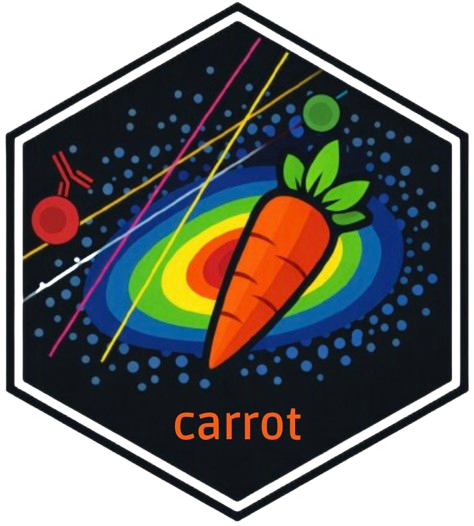

# CARROT

<p align="center">
  
</p>

**C**ytometry **A**nalysis and **R**eporting with **R**-based **O**pen-source **T**ools

CARROT is a complete flow cytometry analysis pipeline. It supports both conventional and spectral cytometry data, and includes the following steps: import, compensation, spectral unmixing, quality control (PeacoQC, flowAI), preprocessing (removal of debris, doublets, and dead cells), and advanced analyses (gating, PCA, UMAP, t‑SNE).  
It combines automated methods with manual, user‑driven procedures.
The tool comes with a Shiny interface for easier use.

CARROT was developed at Institut Cochin (a collaboration between the BIOINFORMAT’IC and CYBIO platforms), with support from the **Association Française de Cytométrie (AFC)**.

---

## Installation (Linux / Mac)

Installation via Docker.

* **macOS** : Docker Desktop — https://docs.docker.com/desktop/setup/install/mac-install/
* **Linux** : Docker Engine (inclut Docker Compose) — https://docs.docker.com/engine/install/

--> If you don't need the Unmixing tab:
* Just run:
  
```bash
docker pull camellialambert/carrot
docker run -dp 80:3838 --rm --platform linux/amd64 --name carrot camellialambert/carrot
```
* On your usual browser access to CARROT at **http://localhost/**
* Once you are finished, close CARROT with :

```bash
docker stop carrot
```
  
--> If you need the Unmixing tab (AutoSpectral):

AutoSpectral needs direct access to a real folder on your computer, to read your FCS files and write its results there. Add a single option to the same command, pointing to that folder:

```bash
docker run -dp 80:3838 --rm --platform linux/amd64 --name carrot \
  -v "/path/to/your/data/folder:/data" \
  camellialambert/carrot
```

**Example:**

```bash
docker run -dp 80:3838 --rm --platform linux/amd64 --name carrot \
  -v "/home/Desktop/Spectral_Data:/data" \
  camellialambert/carrot
```

* On your usual browser access to CARROT at **http://localhost/**
* Once you are finished, close CARROT with :

```bash
docker stop carrot
```

## Features

| Step | Description |
|---|---|
| **Import** | Loading FCS files (conventional or spectral cytometers), marker annotation, management of groups/conditions |
| **Compensation** | Manual gating on single‑stained tubes, computation and interactive editing of the spillover matrix |
| **Unmixing** | Spectral demixing using [AutoSpectral](https://github.com/DrCytometer/AutoSpectral) |
| **Quality control** | Detection of acquisition anomalies with [PeacoQC](https://github.com/saeyslab/PeacoQC) and [flowAI](https://bioconductor.org/packages/flowAI/) |
| **Preprocessing** | Removal of debris, doublets, and dead cells; interactive gating per sample |
| **Analyses avancées** | Hierarchical gating, UMAP / t‑SNE / PCA projections, unsupervised clustering ([FlowSOM](https://github.com/saeyslab/FlowSOM)), statistical comparisons between groups |

A user guide for the interface is available in **guide_utilisateur.pdf**.

---

## Technologies

R / Shiny · flowCore · AutoSpectral · PeacoQC · flowAI · FlowSOM · uwot · Rtsne · plotly

---

## Authors

Camellia Lambert — Master’s internship in Bioinformatics – Platforms Engineering (Université Paris Cité), Institut Cochin

Supervised by Benjamin Saintpierre (BIOINFORMAT’IC platform) and Muriel Andrieu (CYBIO platform)
